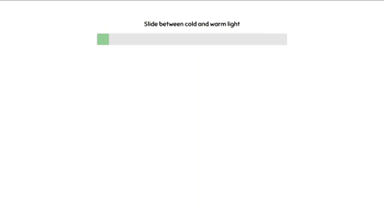

# Webpage touchslider

A touchslider was created (to work with a touchscreen-laptop) to mimic the idea of having a touchslider integrated in a changingroom mirror that would allow the user to switch between warm/cold lighting with their finger.
